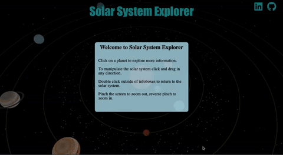

# Solar System Visualization

## Background
Solar System Explorer is an interactive exploration of our solar system. This project contains a 3D rendering of our solar system and allows a user to navigate around and discover interesting facts about the various planets including planet size, gravitational factors, and orbital speeds. As well as Observe the different positions and orbits of planets relative to the sun.

[Live Link](https://leahseyoum.github.io/solar-system-visualization/)

## Three.js
Three.js was utilized to render the individual planets as well as the outerspace scene/planetary environment. The main components included:

1. Scene - where all 3D models live. Also makes individual models accessible through scene.children
2. Light - by leveraging lighting techniques, the project enhances the visual quality and highlights the unique characteristics of each planet.
3. Camera - explore the planets from various angles and distances.
4. 3D models - created using the library's built in geometries as well as TextureLoader to apply a texture coating
5. THREE.raycaster - determines the location of the cursor using coordinates, and assists in determining which planet is being selected. 

## Demo:


## Implementation Highlights

### Planets

The newPlanet function in Three.js allows you to create a new planet in the solar system with customizable features. By specifying parameters such as the planet's size, distance from the sun, texture, and the presence of a ring. The function creates a sphere geometry for the planet, applies a texture to its surface, and positions it accordingly. If a ring is specified, it generates a ring around the planet, adding an extra layer of visual appeal. Additionally, an orbital ring is created to illustrate the planet's path around the sun.

```Javascript
function newPlanet(size, distance, texture, ring) {
        const geo = new THREE.SphereGeometry(size, 50, 50);
        const material = new THREE.MeshBasicMaterial({
            map: textureLoader.load(texture)
        });

        const planet = new THREE.Mesh(geo, material);
        const parentObj = new THREE.Object3D();
        parentObj.add(planet);

        if (ring) {
            let newRing = createRing(ring);
            parentObj.add(newRing);
            newRing.position.x = distance;
            newRing.rotation.x = -0.5 * Math.PI;
            newRing.rotation.set(1.8,0,0);
        }

        
        const orbitRingGeo = new THREE.RingGeometry(
            distance, 
            distance + 0.8,
            80);
        const orbitRingMaterial = new THREE.MeshBasicMaterial({
                color: 0xf5e96c,
                opacity: 0.2,
                transparent: true,
                side: THREE.DoubleSide
        });
        
        const orbitMesh = new THREE.Mesh(orbitRingGeo, orbitRingMaterial);
        orbitMesh.rotation.x = -0.5 * Math.PI;

        scene.add(orbitMesh);
        scene.add(parentObj);
        planet.position.x = distance;
        planetBodies.push(planet);
        return {planet: planet, parentObj: parentObj};
    };
```

### Stars

The Stars function creates a field of 3D stars within the scene. The position of a given star is random and size the the stars are variable, creating a realistic celestial background. 

```Javascript
export function Stars(scene) {
    const vertices = [];


    const numPoints = 2000;
    for (var i = 0; i < numPoints; i++) {
        var x = THREE.MathUtils.randFloatSpread(2500);
        var y = THREE.MathUtils.randFloatSpread(2500);
        var z = THREE.MathUtils.randFloatSpread(2500);

        vertices.push(x, y, z);
    }
    
    const geometry = new THREE.BufferGeometry();
    geometry.setAttribute('position', new THREE.Float32BufferAttribute(vertices, 3));

    const material = new THREE.PointsMaterial({
        color: 0xffffff,
        sizeAttenuation: false,
        size: 2,
    });

    const points = new THREE.Points(geometry, material);
    scene.add(points);

}
```

